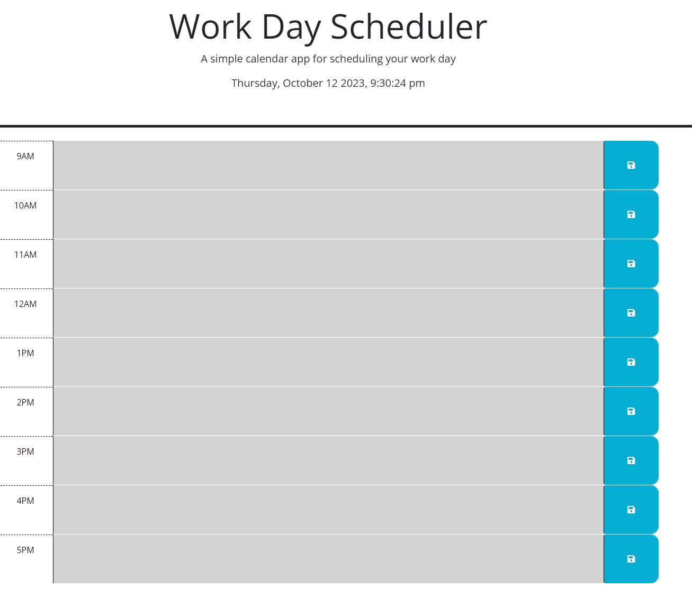
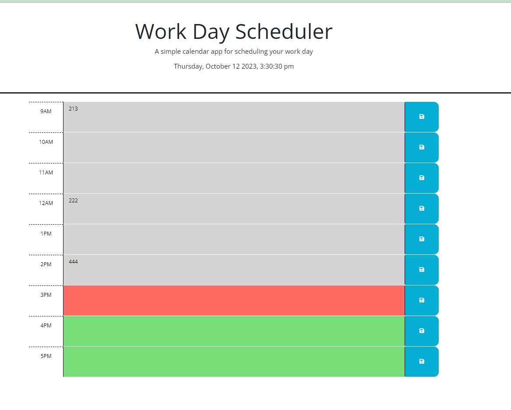

# dayScheduler

## Description

a day scheduler which can record the schedules of a day for the user.
- a current date and time indicator shows on the top section of the scheduler.
- the time sections changes their colors according to the current time:
current time section -- red
passed time section  -- grey
future time section  -- green
- when click the save disk at the end of the time section, the schedule saves and persist when reflash the page.

## Illustration

open and view the contents on https://mkdkck.github.io/dayScheduler/

the page should show like the following pic:

main page when at night:

time section color change when during the day:

HTML, CSS & JS codes can be examined on https://github.com/mkdkck/dayScheduler

## Usage

- open the link to see a fully fucntional website.
- type the contents in each time section of the day.
- click the save disk icon to save the contents of each section.
- the saved contents persist when reopen the page.

## License

N/A

## Badges

